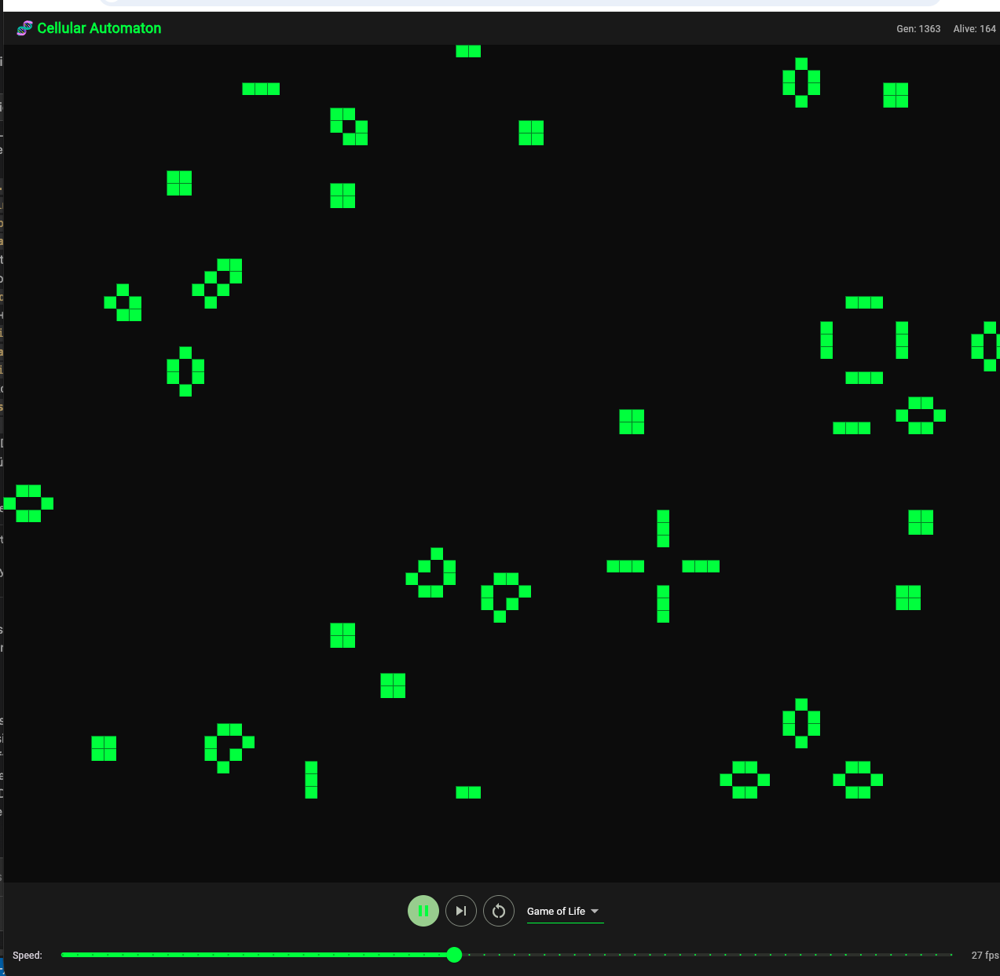

Cellular Automaton — Rust + Flutter Web (WebAssembly)

Eine interaktive Simulation zellularer Automaten im Browser. Der Simulationskern ist in Rust geschrieben und läuft als WebAssembly-Modul, die Oberfläche ist mit Flutter Web umgesetzt.

Tech-Stack

Rust – Simulationskern (ca_core), kompiliert zu WebAssembly via wasm-bindgen / wasm-pack
Flutter Web – Benutzeroberfläche (ca_app), State-Management mit Riverpod
serde / serde_json / toml – Konfiguration und Datenexport
image – PNG-Export der Simulationszustände

Funktionen

Vier Regelwerke für zellulare Automaten, umschaltbar zur Laufzeit:
Game of Life (klassisch)
High Life
Maze
Seeds
Play / Step / Reset der Simulation
Einstellbare Simulationsgeschwindigkeit
Live-Anzeige von Generation und Anzahl lebender Zellen
Export der Simulationsdaten als CSV, JSON und PNG

Alle vier Regelwerke wurden getestet und laufen stabil im Browser.

Installation & Start

1. Rust-Kern zu WebAssembly bauen:
cd cellular-automaton/ca_core
wasm-pack build --target web

2. Flutter-App starten:
cd ../ca_app
flutter pub get
flutter run -d chrome

Was ich dabei gelernt habe

Integration von Rust und Flutter über WebAssembly (FFI-ähnliche Anbindung via wasm-bindgen und flutter_rust_bridge)
Architektur eines Simulationskerns mit austauschbaren Regelwerken (Strategy-Pattern in Rust)
State-Management in Flutter mit Riverpod
Implementierung mehrerer Exportformate (CSV, JSON, PNG) für Simulationsdaten
Performance-Überlegungen bei der Übergabe größerer Datenmengen zwischen Rust und JavaScript/Dart

Hintergrund

Entstanden als Projekt im Rahmen der Ausbildung zur AI Mobile App Developer (AppAkademie). Ziel war ein robuster Proof of Concept nach professionellen Standards – modular und erweiterbar statt reiner Bastellösung.
